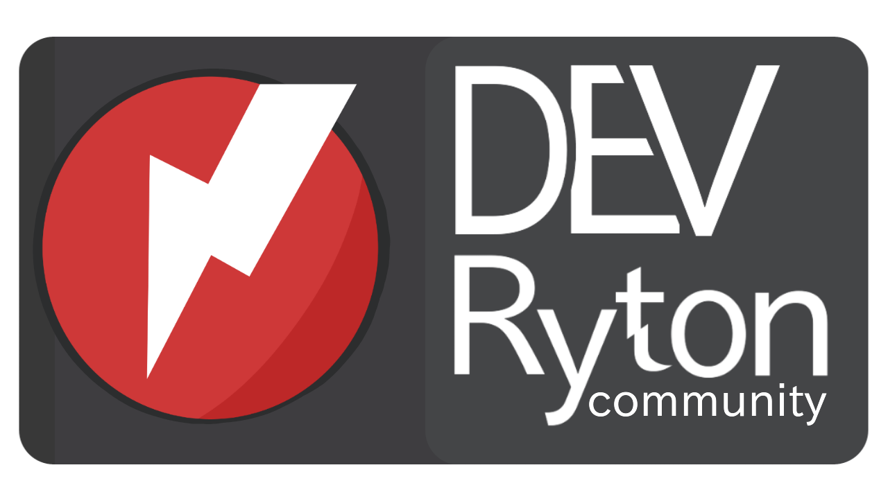

# Ryton Programming Language

Ryton - современный, мульти-парадигменный и мульти-платформенный язык программирования высокого уровня, который делает правильное простым, а сложное - понятным.



Ryton следует философии "хочешь лучше - делай проще", предоставляя разработчикам современные инструменты в максимально понятной форме. Все проекты на Ryton распространяются под специальной открытой лицензией, формируя экосистему качественного и прозрачного программного обеспечения.

Ryton - это язык для тех, кто ценит простоту, производительность и открытость в разработке профессионального ПО.

## Особенности

- Под капотом CPython 
- Возможность Компиляции и сборки проекта на Ryton в нативный код C при помощи инструмена RytonBulder использующий Nuitka и P4A(Python for Android)
- Обширная стандартная библиотека
- Поддержка мультиплатформенности
- способность импортировать и использовать библиотеки написанные на других языках. Таких как C, Python и JVM(Java) # в будущем поддержка kotlin и scala
- возможность вызвать код [ZigLang](https://github.com/ziglang/zig) пр/мо из кода Ryton
- Чистый и интуитивный синтаксис
- Встроенная поддержка DSL
- Мощная система метапрограммирования

## Для чего можно использовать Ryton
- Разработка приложений для мобильных устройств
- Разработка игр
- Разработка веб-приложений
- Разработка серверных приложений
- Разработка десктопных приложений
- Разработка инструментов для разработки
- Разработка Профисионального Программного Обеспечения
- Разработка AI и ML

## Быстрый старт
- сборка из исходников
```bash
git clone https://github.com/CLt/RytonLang
cd RytonLang
python3 -m venv ryton_venv
source ryton_venv/bin/activate
./build.sh
```
После усешной сборки выполучите исполняемый файл ryton_laucnher.bin по пути ./dist/ryton_launcher.dist/ryton_laucnher.bin.
**Пердуприждение**: данный файл не обхадимо запускать из папки dist/ryton_launcher.dist/ иначе не заработает(зависимости не будут найдены)

- Рекомендуем установить дополнительные библиотеки для RytonLang:
  - Для Ubuntu-подобных систем
   ```bash
   sudo apt install ccache
   ```
  - Для Arch-подобных систем
   ```bash
   sudo pacman -S ccache
   ```

- **Примечание**: RytonLang не поддерживается на Windows оффициально. некотрые библиотеки могут работать некорректно или вообще не работать. Что вхудшем случае может привести к крашу Windows.
Рекомендуем использовать WSL для Windows или полноценный Linux(Ubuntu, Manjaro, Arch, Alpine) для работы с RytonLang.

## Примеры кода
```
module import {
    std.UpIO
}

func Main {
    print('Hello World')
}
```
*ещё примеры кода см. в* [examples.md](examples.md)

## Структура проекта
```
RytonLang/
├── Interpritator/     # Ядро языка :полностью функционирует:
├── docs/             # Документация  :в разработке:
└── tools/            # Инструменты разработки :в разработке:
```

Лицензия
Copyright (c) 2024 DichRumpany team. См. [LICENSE](LICENSE) для деталей.

Команда
- RejziDich - Lead Developer
- CodeLibraty team - Core Team

Контакты
- GitHub: https://github.com/Rejzi-dich/RytonLang
- EMail:  rejzidich@gmail.com или rejzi@drt.com(нестабилен)

Сообщество
- Site project: https://ryton.vercel.app
- Site team:    https://siteclt.vercel.app
- Discord:      https://discord.com/invite/D2hqwn94rs

